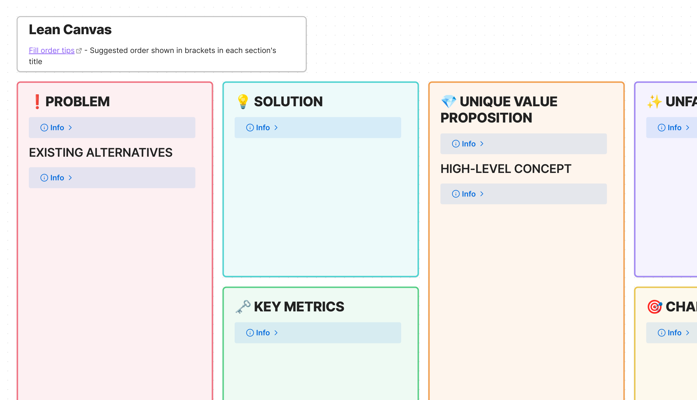

# Obsidian Lean Canvas Template

# Project Title

[Obsidian canvas](https://obsidian.md/canvas) templates for [lean canvas](https://www.leanfoundry.com/tools/lean-canvas) business modelling, as created by [Ash Maurya](https://www.leanfoundry.com/about).

## Description

The simple templates can be used as a starting point if you want to iterate your business canvas in Obsidian alongside all your other notes. It contains both the lean canvas and the "leaner canvas" which are covered in detail in the book [Running Lean](https://www.leanfoundry.com/books/running-lean) and covered extensively on the lean foundary website.

## Getting Started

### Dependencies

These templates simply require an installation of Obsidian from the past couple of years which has Canvas support.

### Installing

* Download [Lean Canvas]() and/or [Leaner Canvas]() directly and save them somewhere within the vault you want to use them from. 
* It's suggested to have a templates folder and put the main copies in there

### Using

For using, either right click on the filename and "make a copy" from in obsidian, or if you want to keep your various iterations of a lean canvas in the same file, you can copy/paste from within the canvas.

## Differences from alternatives

### lean-canvas-for-obsidian
This project was forked and a few key changes made:
1. That project uses seperate referenced markdown files for each box, which makes it hard to clone the canvas.
1. Default collapsed info boxes with filling tips were added.
1. The fill order was removed since filling the canvas in a particular order is not suggested in Runnning Lean.
1. Links and licence attribution were added.

## Authors

[Ben Howes](https://ben-howes.co.uk)

## Version History

* 0.1
    * Initial Release

## License

This project is licensed under the CC0 1.0 License - see the LICENSE.md file for details.

## Acknowledgments

* Lean canvas and leaner canvas created by [Ash Maurya](https://www.leanfoundry.com/about) 
* This project was forked and iterated from [lean-canvas-for-obsidian](https://github.com/YJPL/lean-canvas-for-obsidian) by [YJPL](https://github.com/YJPL) 